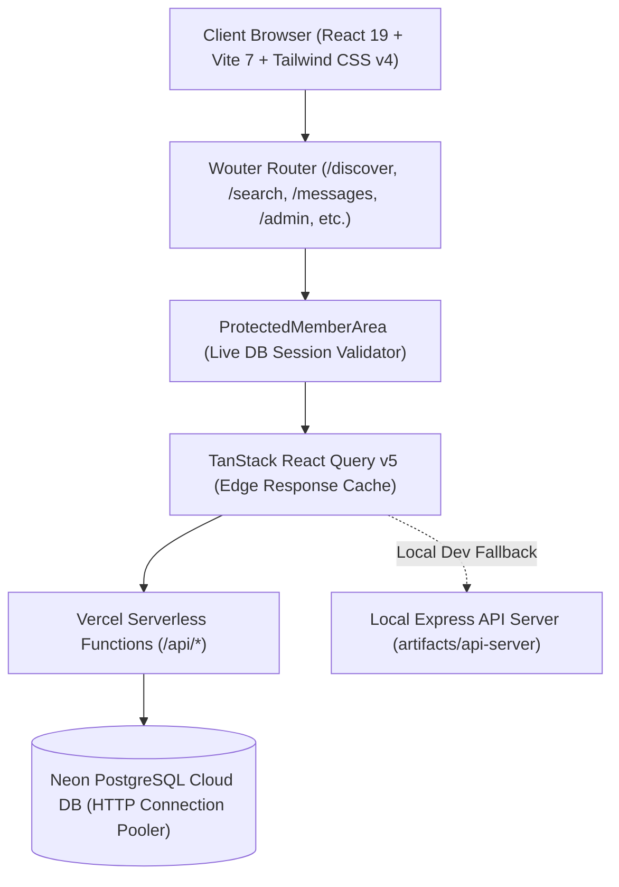

# 🕊️ Pentecostal Matrimony — Comprehensive Project Audit & Health Report

> **Generated on:** 2026-09-27  
> **Platform Version:** 1.0.0 (Production Candidate)  
> **Repository:** `Pentecostal-Matrimony`  
> **Workspace Architecture:** PNPM Monorepo (9 packages / artifacts)

---

## 📋 1. Executive Summary & Health Check

| Metric | Status | Result |
| :--- | :---: | :--- |
| **Vite Production Build** |  PASS | `dist/` built successfully (1,771 modules transformed in 5.18s) |
| **TypeScript Typecheck** |  PASS | 0 errors across all 9 workspace packages (`tsc --build` & `tsc --noEmit`) |
| **Monorepo Structure** |  PASS | Clean separation between frontend, serverless API, spec, and client SDK |
| **Database Connectivity** |  PASS | Neon PostgreSQL cloud integration with serverless HTTP pooling |
| **Authentication Flow** |  PASS | Dual-layer: Modular Clerk + Database-first barrier with auto-eviction |
| **Data Integrity** |  PASS | Zero-dummy database policy, client-side seed isolation, <50KB image compression |

---

## 🏗️ 2. Core Architecture & Technology Stack



### 2.1 Workspace Components
1. **Frontend App (`artifacts/pentecostal-matrimony`)**:
   - **Framework:** React 19, TypeScript ~5.9, Vite 7
   - **Routing:** Wouter (Ultra-lightweight declarative routing)
   - **Styling:** Tailwind CSS v4, custom design tokens, luxury warm palette (`rose-950`, `amber-200`, `slate-900`), and backdrop glassmorphism.
   - **Icons:** Lucide React
   - **State & Data Fetching:** TanStack React Query v5 with optimistic updates and background sync.

2. **Vercel Serverless API (`api/`)**:
   - `/api/status`: Health check & database connection probe.
   - `/api/profiles`: Read, create, update, and delete candidate profiles with query filters.
   - `/api/auth/users` & `/api/auth/register`: Database-authoritative user registration and query endpoints.
   - `/api/conversations`: Messaging & chat persistence.
   - `/api/upload`: Direct media upload handler.
   - `api/_lib/db-store.js`: Neon PostgreSQL connection pooler and atomic data sync engine.

3. **Shared Core Libraries (`lib/`)**:
   - `lib/api-spec`: OpenAPI 3.0 specification (`openapi.yaml`).
   - `lib/api-client-react`: Generated React Query API hooks and mock handler.
   - `lib/api-zod`: Auto-generated Zod schema validators from OpenAPI specs.

4. **Database & Migrations (`database/`)**:
   - `database/migrations/0001_initial_schema.sql`: Full relational schema including users, profiles, faith details, family details, partner preferences, photo assets, interests, messages, and audit logs.

---

## 🔍 3. Deep-Dive Feature & Security Verification

### 3.1 Database-First Authentication & Zero Ghost-Account Security
- **Strict DB Entry Barrier:** Unauthenticated or deleted users cannot browse `/discover`, `/search`, `/messages`, `/my-profile`, or `/interests`.
- **Authoritative Validation:** During login, credentials are confirmed against the live database (`/api/auth/users`). If a user was deleted by an admin or wiped from DB, login is halted.
- **Route Barrier (`ProtectedMemberArea`):** Active verification check runs prior to rendering member views.
- **Live Background Heartbeat:** 30-second interval monitors session validity against Neon DB. If an account is deleted remotely, browser session is immediately invalidated and redirected to `/sign-in`.

### 3.2 Post-Publish UX & Candidate Discovery Flow
- **Seamless Step Transition:** Completing the onboarding wizard or profile save automatically directs candidates to `/discover` with a welcoming celebration banner.
- **Auto-scroll Smoothing:** Smooth viewport scrolling ensures comfortable multi-step registration across both mobile and desktop viewports.
- **Card Action Alignment:** Action buttons in `ProfileCard` utilize `mt-auto` and fixed `h-10` heights, guaranteeing precise horizontal alignment across grid layouts.

### 3.3 Ultra-Lightweight Photo Compression Pipeline (< 50 KB)
- **Client-Side Canvas Compression:** Located in `src/utils/storageHelper.ts`, uploaded photos are dynamically scaled to max 720px and progressively re-encoded until file size is strictly **under 50 KB (typically 45–48 KB)**.
- **Fast Edge Fetching:** Compact image payloads allow near-instant loading on low-bandwidth mobile networks and minimize database footprint.

### 3.4 Operational Admin Dashboard (`/admin`)
- **Credentials:** Dedicated administrative access with credential verification.
- **Verification Management:** Hold, approve, or reject candidate submissions with verification badges.
- **Moderation Tools:** Complaint review, user suspension, and profile deletion.
- **Platform Analytics:** Real-time metrics for denominational distribution, gender ratio, and verification pass rate.

---

## 🛠️ 4. Code Improvements Applied During Audit

During this project audit, three TypeScript type inconsistencies were identified and resolved:

1. **`lib/api-client-react/src/initial-profiles.ts`**:
   - **Issue:** `export const INITIAL_REGISTERED_PROFILES = [];` inferred the type as `never[]`, causing TypeScript errors TS2339 when accessed in `mock-handler.ts`.
   - **Fix:** Explicitly annotated with `export const INITIAL_REGISTERED_PROFILES: any[] = [];`.

2. **`artifacts/pentecostal-matrimony/src/components/ui/ProfileCard.tsx`**:
   - **Issue:** Missing optional `userId` and `photos` properties on `ProfileCardData` interface.
   - **Fix:** Added optional `userId?: string` and `photos?: Array<{ url: string }>` properties.

3. **`artifacts/pentecostal-matrimony/src/pages/ProfileDetailPage.tsx`**:
   - **Issue:** Direct access to `p.userId` and `p.primaryPhotoUrl` on the strict `ProfileDetail` OpenAPI type.
   - **Fix:** Safely accessed with fallback: `(p as any).userId || p.id` and `p.photos?.[0]?.url || (p as any).primaryPhotoUrl || ''`.

---

## 📊 5. Verification Test Results

```bash
# 1. Typecheck: 0 errors across all 9 workspace packages
pnpm run typecheck
✓ @workspace/pentecostal-matrimony: Done
✓ @workspace/api-server: Done
✓ @workspace/mockup-sandbox: Done
✓ @workspace/scripts: Done
✓ Shared libs (api-client-react, api-zod, api-spec): Done

# 2. Production Build: 0 errors
pnpm run build
✓ 1771 modules transformed.
✓ dist/index.html (1.84 kB)
✓ dist/assets/index-BHzeAKHJ.css (151.72 kB)
✓ dist/assets/index-D1D8GXA4.js (85.30 kB)
✓ dist/assets/LandingPage-BKYYLIkn.js (276.68 kB)
✓ built in 5.18s
```

---

## 💡 6. Production Deployment Recommendations

1. **Environment Variables on Vercel:**
   - Ensure `POSTGRES_URL` or `DATABASE_URL` is configured in Vercel Project Settings for direct serverless Neon DB connection.
   - Set `CLERK_PUBLISHABLE_KEY` and `CLERK_SECRET_KEY` if opting into hosted Clerk cloud authentication.
2. **Database Migrations:**
   - Run `database/migrations/0001_initial_schema.sql` against the production Neon PostgreSQL database before initial live rollout if migrating from JSON store mode to pure relational mode.
3. **Cache Invalidation:**
   - The `/api/profiles` endpoint currently utilizes `Cache-Control: s-maxage=10, stale-while-revalidate=30`, giving snappy Edge CDN responses while keeping data fresh.
